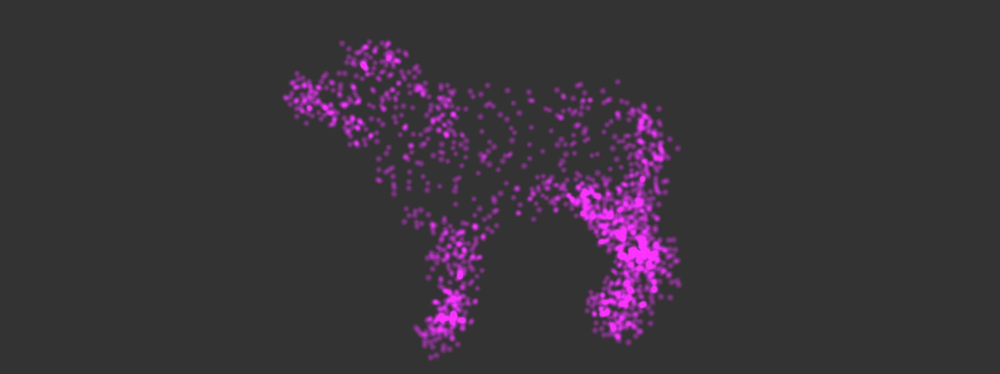
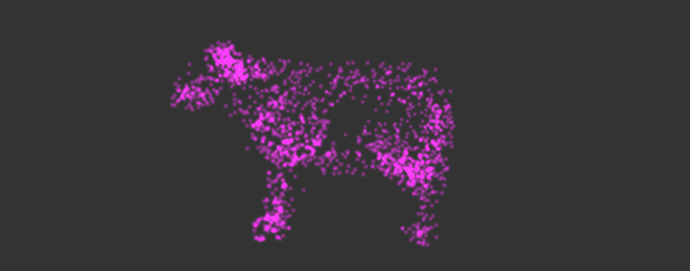

Author: Yuru Wang

Date: 3/20/2018

---------------------------------------------------------------------------------------------------------------------------------------

Github demo link: https://yuruwang.github.io/homework-6-particle-system-yuruwang/

----------------------------------------------------------------------------------------------------------------------------------------

Mouse interaction guide:

1. Left click on the mouse to control the camera.

2. Press right botton on the mouse to attact particles to the point where mouse is pointing, and release the right mouse button to give particels a repel force. (please don't drag the mouse while you are attracting particles)

--------------------------------------------------------------------------------------------------------------------------------------
screen shots:

